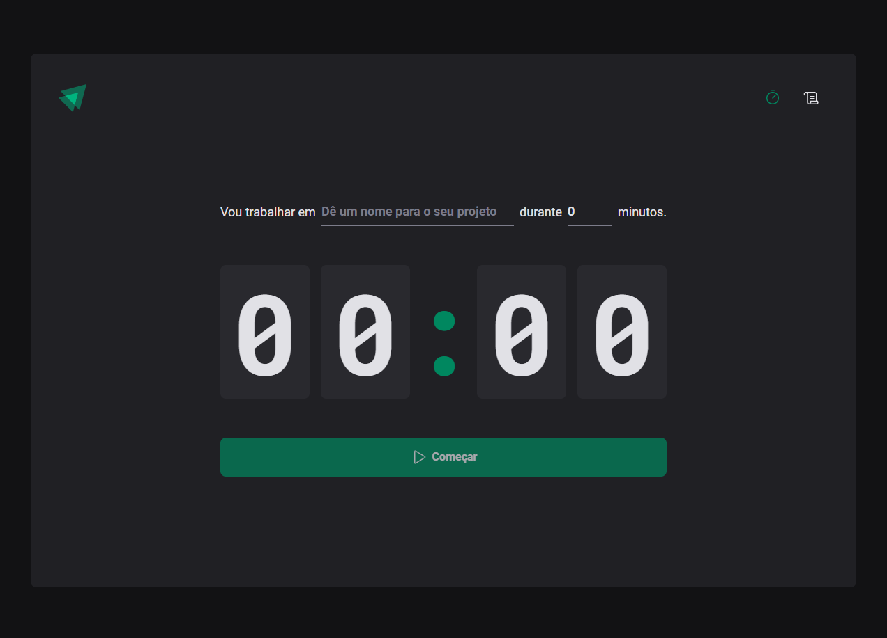
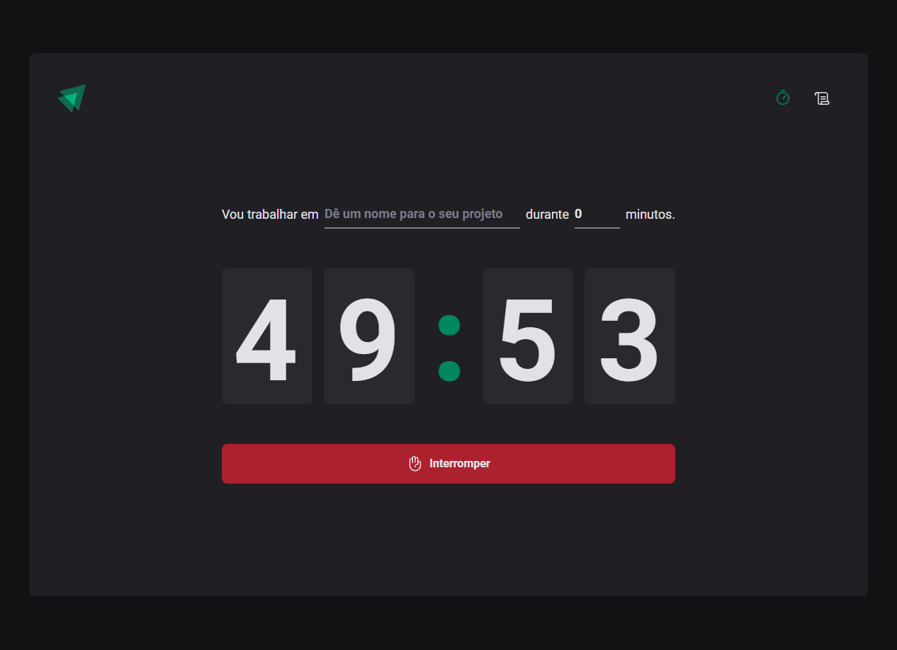
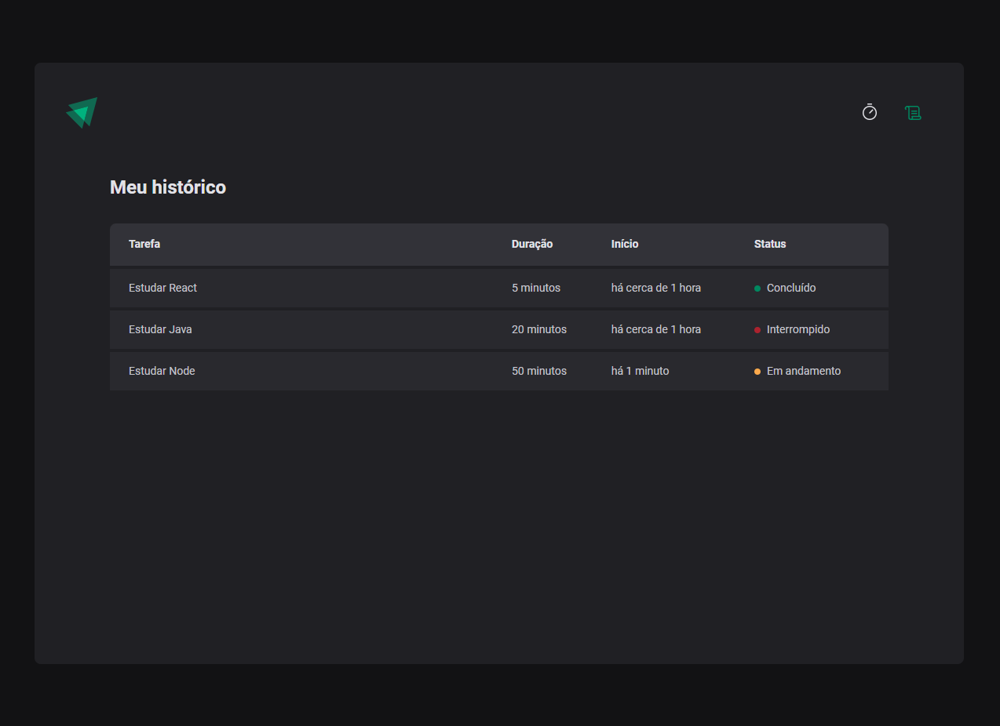

# Ignite Timer

    

    

    

## Dependências
* [ReactJS](https://pt-br.reactjs.org/docs/getting-started.html)
* [date-fns](https://date-fns.org/docs/Getting-Started)
* [immer](https://immerjs.github.io/immer/)
* [phosphor-react](https://github.com/phosphor-icons/phosphor-react)
* [React Hook Form](https://react-hook-form.com/get-started/)
* [React Router Dom](https://v5.reactrouter.com/web/guides/quick-start)
* [Styled Components](https://styled-components.com/docs)
* [Zod](https://github.com/colinhacks/zod)

